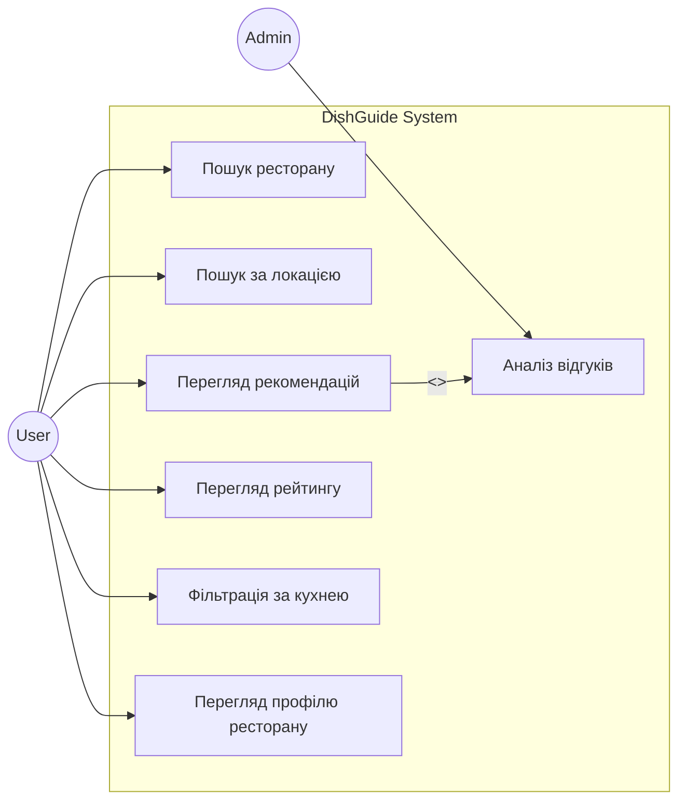
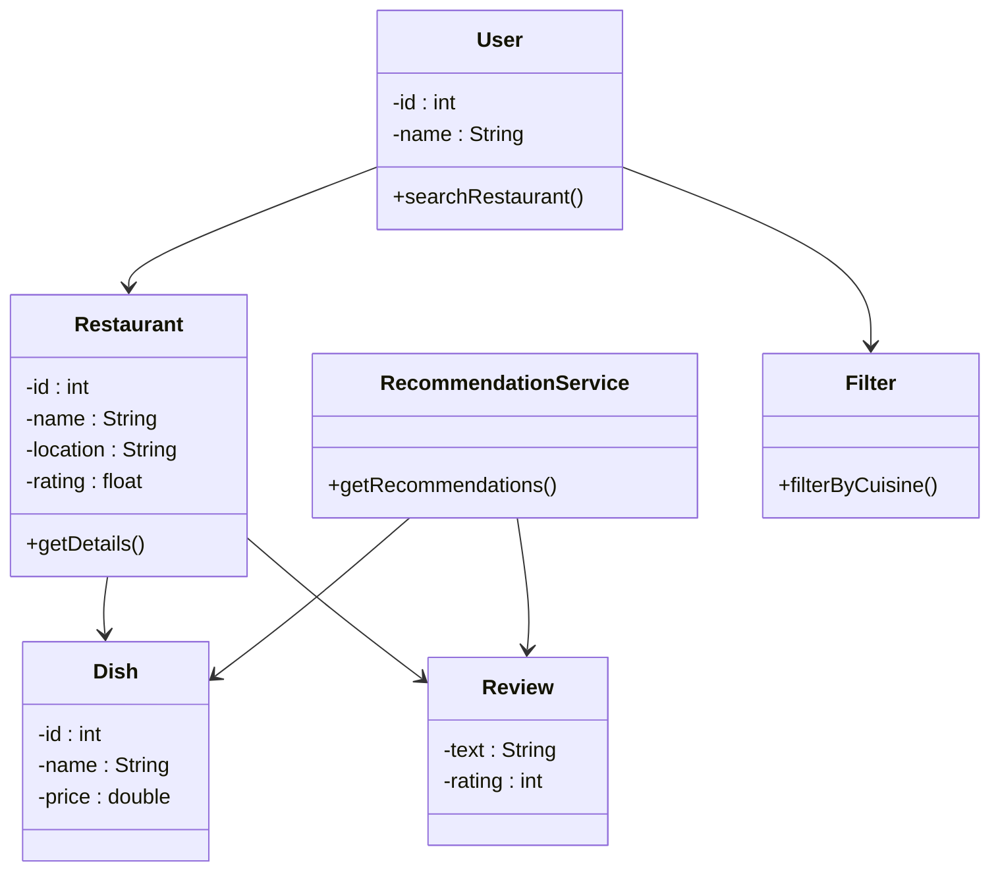
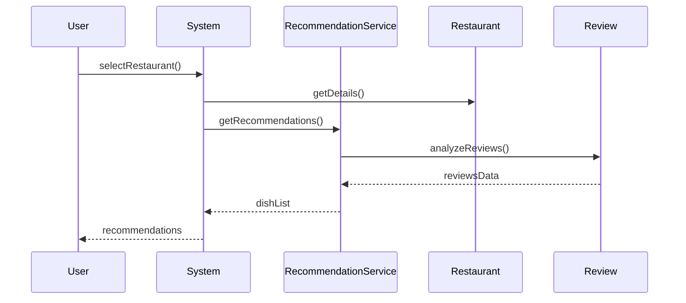

# UML Lab Work 2  
## DishGuide

---

## Опис проєкту

DishGuide — це система рекомендацій страв у ресторанах на основі відгуків користувачів.

---

## Functional Requirements

| ID | Опис |
|----|------|
| FR-01 | Користувач може шукати ресторани |
| FR-02 | Користувач може шукати ресторани за місцем розташування |
| FR-03 | Користувач може переглядати рекомендовані страви |
| FR-04 | Користувач може переглядати рейтинг ресторану |
| FR-05 | Користувач може фільтрувати ресторани за кухнею |
| FR-06 | Користувач може переглядати профіль ресторану |
| FR-07 | Система надає рекомендації страв на основі відгуків |

---

## Use Case Diagram

---

## Class Diagram

---

## Sequence Diagram

---

## Traceability Matrix

| Functional Requirement | Use Case | Classes | Sequence Diagram |
|----------------------|----------|--------|------------------|
| FR-01 | Пошук ресторану | User, Restaurant | ✔ |
| FR-02 | Пошук за локацією | User, Restaurant | — |
| FR-03 | Перегляд рекомендацій | User, RecommendationService | ✔ |
| FR-04 | Перегляд рейтингу | User, Review | — |
| FR-05 | Фільтрація за кухнею | User, Filter | — |
| FR-06 | Перегляд профілю ресторану | User, Restaurant | — |
| FR-07 | Аналіз відгуків | RecommendationService, Review | ✔ |
